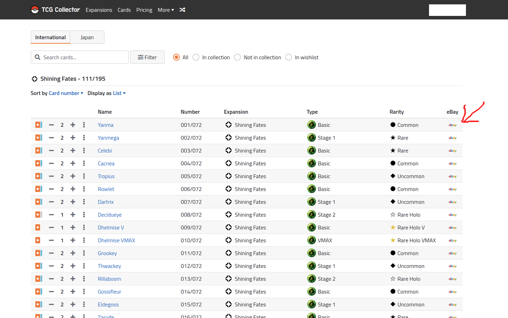
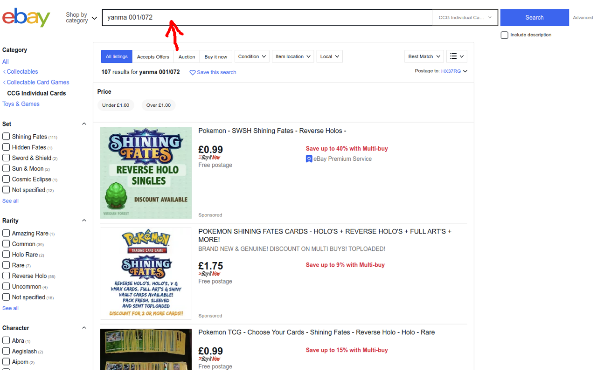

#  TCG Collector Ebayer Chrome Extension

Adds a quick deep link to an eBay listings page to [https://www.tcgcollector.com/](https://www.tcgcollector.com/)

## Install

[**Chrome** extension](https://chrome.google.com/webstore/detail/pokebay-lookup-tool/lkmcogjefgehdbfeliegkjamjmbhjoie)

[**Firefox** extension](https://addons.mozilla.org/en-GB/firefox/addon/tcg-collector-ebayer/)

## Instructions
* Place your eBay web URL of choice in the box above and hit "Save" (i.e: https://www.ebay.co.uk)
* Navigate to your chosen extension list on TCG Collector
* Click the eBay icon on the right of the table row and a new tab will open with the search prefilled!
* Please post issues and suggestions <a href="https://github.com/shutupflanders/pokebay-chrome-extension-issues">here</a>
* Thank you for using this extension, please consider buying me a <a href="https://www.buymeacoffee.com/IcV9egW">beer</a> if you like it!
    (I don't drink coffee)

### Screenshots

## Contribution

Suggestions and pull requests are welcomed.

---

## Development

* Pull the repository
* Run `npm install` to install dependencies.
* Run `npm run build-<<chrome|firefox>>` to build the package for testing.

## Donations

If you like my work, please consider buying me a beer (I don't drink coffee)

[![Buy me a coffee][buymeacoffee-shield]][buymeacoffee]

[buymeacoffee-shield]: https://www.buymeacoffee.com/assets/img/guidelines/download-assets-sm-2.svg
[buymeacoffee]: https://www.buymeacoffee.com/IcV9egW
